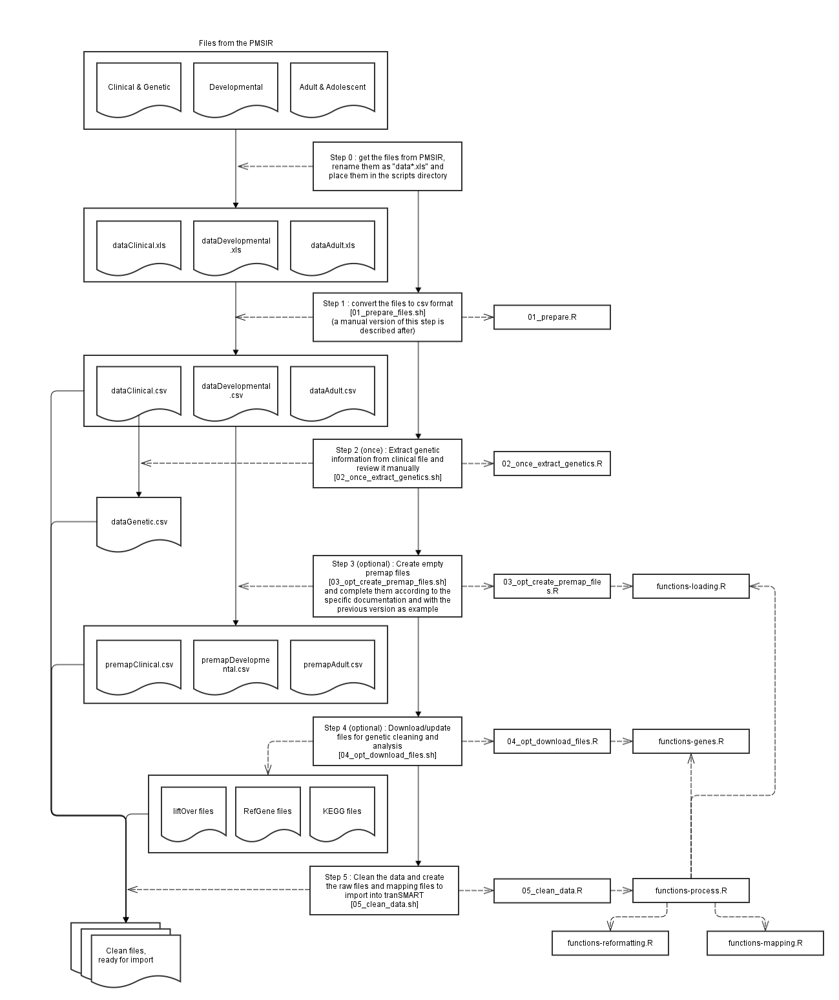
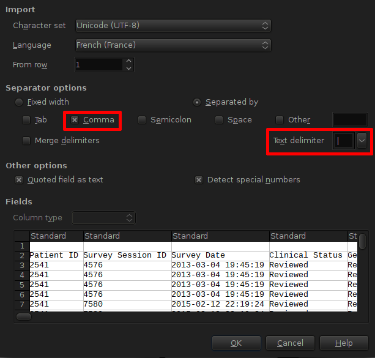

README
======

R scripts to load and clean PMSIR raw data files.

This diagram is an overview of the process. On the left are the data manipulated by each steps. On the right are the R scripts called for each step.  
Each step is detailed after the diagram.



Step 0
------

Get the files from PMSIR.  
Three input files are obtained from the registry:

* Clinical Questionnaire + Genetic test results
* Developmental Questionnaire
* Adolescent and Adults Questionnaire

These three files are HTML tables in .xls files. **Do not open these files with excel !**

They must first be renamed as following:
* dataClinical.xls for the Clinical&Genetic Questionnaire
* dataDevelopmental.xls for the Developmental Questionnaire
* dataAdult.xls for the Adolescent and Adults Questionnaire

and placed in the scripts folder.
The scripts need the dplyr and tidyr R packages that you can install with this command:
```R
install.packages(c("dplyr","tidyr"))
```

Step 1
------

The files must be converted to the csv format.  
This is done using the first script: *01_prepare_files.sh*  
This script calls the *01_prepare.R* R script.  
Three new files are created:
* dataClinical.csv
* dataDevelopmental.csv
* dataAdult.csv

These files are **UTF-8 encoded**, **comma (,) separated**, with **pipes (|) as quotes** to delimit text fields.  
You can check the csv files by opening them in LibreOffice (excel doesn't accept pipes as text delimiters)



Step 1 - Manual alternative
---------------------------

**In case step 1 fails**, it can still be done manually using the following procedure:  
The files must first be prepended with the following lines so that Excel/LibreOffice registers the correct encoding:
```html
<html>
<head>
<meta http-equiv="Content-Type" content="text/html; charset=utf-8">
</head>
```
Open the files in a text editor, add these 4 lines at the beginning of the file and save it.  
Open the files in Excel/LibreOffice.  
The files contain the entirety of the data two times (headers included) that have to be removed.  
Save the files to the csv format (US type: separator is a comma (,), blocks of text surrounded by pipes (|)) using the following naming convention:  
* dataClinical.csv for the Clinical&Genetic Questionnaire
* dataDevelopmental.csv for the Developmental Questionnaire
* dataAdult.csv for the Adolescent and Adults Questionnaire

Step 2 (run once)
-----------------

The genetic data must be extracted from the dataClinical file.  
To do so, run the second script: *02_once_extract_genetics.sh*  
This script calls the *02_once_extract_genetics.R* R script, and creates the *dataGenetic.csv* file.  
This file must be reviewed manually. This process is detailed in a dedicated section of this readme.

Step 3 (optional)
-----------------

Regenerate the premapping files.  
The *03_opt_create_premap_files.sh* script uses the data files to generate the empty premapping files.  
This script calls the *03_opt_create_premap_files.R* R script, which in turn uses functions from the *functions-loading.R* script.  
The script creates three premapping files, one for each data file:
* premapClinical.csv
* premapDevelopmental.csv
* premapAdult.csv

The premapping files are used to tell how to process each variable and where to put it in the ontology.  
Already filled in premapping files are on the repo and will work as long as the structure of the registry doesn't change.  
In case there are modifications to make to the processing, these premapping files can be amended.  
In case the registry changes (new variables, renamed variables, etc.), the premapping files can be generated again from scratch.
They then have to be completed again, mainly using the previous ones as a template.  
A more in-depth manual on how to use the premapping files and add processing code to the scripts can be found in a dedicated section of this readme.

Step 4 (optional)
-----------------

Download or update the files and tools used to process the genetic data.
The *04_opt_download_files.sh* script calls the *04_opt_download_files.R* R script which in turn uses a function from the *functions-genes.R* script.  
This downloads the following files:
* **liftOver**
	+ the liftOver tool itself
	+ hg17ToHg19.over.chain.gz : mapping file from Human Genome Assembly Hg17 to Hg19
	+ hg18ToHg38.over.chain.gz : mapping file from Human Genome Assembly Hg18 to Hg38
	+ hg19ToHg38.over.chain.gz : mapping file from Human Genome Assembly Hg19 to Hg38
* **RefGene**
	+ refGene.txt.hg17 : gene references for Human Genome Assembly Hg17
	+ refGene.txt.hg18 : gene references for Human Genome Assembly Hg18
	+ refGene.txt.hg19 : gene references for Human Genome Assembly Hg19
	+ refGene.txt.hg38 : gene references for Human Genome Assembly Hg38
* **KEGG**
	+ KEGG_genes.txt : KEGG Genes list
	+ KEGG_pathways.txt : KEGG Pathways list
	+ KEGG_link_genes_pathways.txt : KEGG relations between genes and pathways

The liftOver tool is used to convert chromosome coordinates to the latest Human Genome Assembly (GRCh38/hg38):  
* hg17 -> hg19 -> hg38
* hg18 -> hg38
Some coordinates still cannot be converted, so the result is a mix of different human genome assemblies, with the fewest not up to date as possible.

The RefGene files are used to extract the name of the genes affected by the deletions.  
Because some coordinates cannot be converted to the latest genome assembly, the refGene files for all assemblies are downloaded.

The KEGG files are used to extract the pathway annotations for each gene.

Step 5
------

Use the prepared files, the premapping files and the external tools to clean the data and enrich the genetic test results.  
The *05_clean_data.sh* scripts calls the *05_clean_data.R* R script, which in turn uses functions from:
* *functions-loading.R* to load the data and premapping files
* *functions-process.R* to process each level of depth of the data
* *functions-mapping.R* to generate the Kettle mapping file
* *functions-reformatting.R* to reformat and clean variables according to the rules in the premapping files
* *functions-genes.R* to enrich the genetic information

This final script creates the *output/* directory containing the cleaned data files (one for each section of each questionnaire) and the Kettle mapping file.

The files **[Cleaning data overview.pdf](Cleaning data overview.pdf)** and **[PMSIR Data Management Algorithm Detailed.pdf](PMSIR Data Management Algorithm Detailed.pdf)** illustrate how this step works internally.  
The source files (*.svg) for these diagrams are provided.
***

Premapping files
================

The premapping files define:
* what are the useful variables in the data files
* where they are located
* where they should go in the ontology tree
* if the variable is an historic variable or an evolutive one
* if and what reformatting is needed
* how different variables are linked together, which is used by the reformatting option

The structure of the ontology tree in i2b2/tranSMART is as follows:
* Questionnaire
	+ SubFile
		+ First header
			+ Second header

For example:
* Clinical
	+ Ears - Hearing
		+ Has the patient had any of the following hearing tests?
			+ Behavioral audiometry
			+ Tympanogram
		+ Has the patient had ear tubes
	+ Mouth - Dental
		+ Has the patient ever ground his or her teeth?
			+ Yes, during the day
			+ Yes, during the night
			+ No
			+ Unsure

The structure of the file is as follows:

ColNum | Head1 | Head2 | SubFile | Evo | Reformat | VarName | Linked | Header
------ | ----- | ----- | ------- | --- | -------- | ------- | ------ | ------
The column number in which to find the variable in the data file | The first header | The second header | The "subfile" in which it should reside | The evolutive status | The reformatting function to use | The new variable name after reformatting | A number to show links between variables | The complete name of the variable found in the data files
Auto   | Auto  | Auto  | Manual | Manual | Manual | Auto    | Auto   | Auto
 |       |       | From the registry structure, absent from the export files | From epidemiologist expertise. Any variable refering to the current status of the patient | Function to use to reformat the variable | | |
 |       |       | Plain text string | 1 if evolutive, nothing if not | name of the R function to use | | |

If you want to add new reformatting options, write an R function in *functions-reformatting.R* with a unique name that will be used to reformat the data, such as the *refactor* function.
A prototype for such a function (here it does nothing and just uses the data as-is) is:
```R
new_reformat_fn <- function(data, premap)
{
  # The 'premap' object is the subset of the premapping corresponding to the
  # current First Header level of the ontology processed
  # The 'data' object is the subset of data corresponding to the subset of the premap object passed
  # So in theory, only one reformatting function can be used for one "First Header" subset of variables.
  # Which cells are marked with the reformatting option, and the content of the
  # Linked cell can be used as hints to control the behavior of the function
  # The whole function could be written as just "data" to return the data
  # exactly as-is. But here I show how to use relevant information from the two passed objects

  # Create new data frame to contain transformed/curated data
  # This object must always contain the three variables Patient.ID, Survey.Date and Birthdate
  data2 <- select(data, Patient.ID, Survey.Date, Birthdate)

  # Create the variables in the output object, here with the same names as
  # originally, which can be found in the premap object
  # This is where variable selection and/or creation can be done.
  varnames <- premap$Header 

  # Here we just copy the contents from the original data to the output data2.
  # This is where transformation can be done.
  data2[varnames] <- data[varnames]

  # Return the new object
  data2
}
```
***

Cleaning the genetic results
============================

Step 2 extracts genetic information from the clinical file.  
First, dates are harmonized to be compared, and variable names are cleaned.  
Output variables are created and automatically populated as best as possible using the current curated fields, and reordered for ease of manual editing.  

Non informative test results are censored (Karyotypes, too imprecise, "No result provided", and results without a human genome browser build). Also, only verified results by the genetic consultant are kept.  
Of these relevant and reviewed informations, only the most up-to-date test result is kept.

These first steps create the *dataGenetics.csv* file which is far from perfect and needs manual reviewing.  
The file should contain only one line per patient, so if a patient appears on two lines (two reports on the same day), the information on the two lines must be merged and conflicts resolved. This can also work as a validation step for typos. (see patient 2541 for example).  
The genetic information relevant for analyses must appear in the following columns:

Result.type | Gain_Loss.N | Chr_Gene.N | Start.N | End.N | Origin.N
----------- | ----------- | ---------- | ------- | ----- | --------
The way all the N results are expressed | What is the defect | On which gene or chromosome is the defect | Start position | End position | Origin of the defect
coordinates | Gain | 22 | 49123456 | 49691432 | de novo
coordinates | Loss | 1 | 249123456 | 249250621 | maternally transmitted
mutation | del | SHANK3 | 4576 | 4586 | de novo
mutation | dup | SHANK3 | 3525 | 3527 | unknown
mutation | >T | BRCA2 | 2134 | 2134 | unknown

In the prepared *dataGenetics.csv* file, N=4 sets of these columns are present. If needed you can add as many sets, suffixing them with ascending numbers.  
The genetic information automatically present in these columns should be reviewed for typos, errors and missing information. The genetic information can be looked for in the Comments, Std.Nomenclature, Position.Start.Max, Position.End.Max columns which can be used to validate and/or complete the information already available.  

All the genetic information on one line should be expressed using the same human genome browser build. The [online liftOver tool](http://genome.ucsc.edu/cgi-bin/hgLiftOver) can be used to translate coordinates from one build to the other.  
Mutations don't need a browser build.  
For missing browser builds (Unknown), the browser can be inferred by looking at the test date and the coordinates ranges for the chromosomes in each build:

Chromosome | hg17 | hg18 | hg19 | hg38
---------- | ---- | ---- | ---- | ----
1 | 245,522,847 | 247,249,719 | 249,250,621 | 248,956,422
17 | 78,774,742 | 78,774,742 | 81,195,210 | 83,257,441
18 | 76,117,153 | 76,117,153 | 78,077,248 | 80,373,285
22 | 49,554,710 | 49,691,432 | 51,304,566 | 50,818,468
Year of release | 2004 | 2006 | 2009 | 2013

When in doubt (or impossible to decide), hg18 is (at the time of writing) still the most widely used human assembly.
